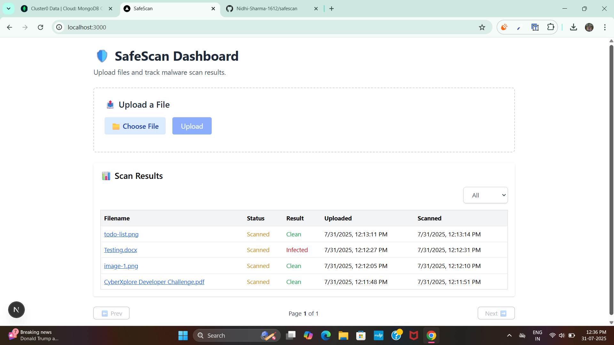
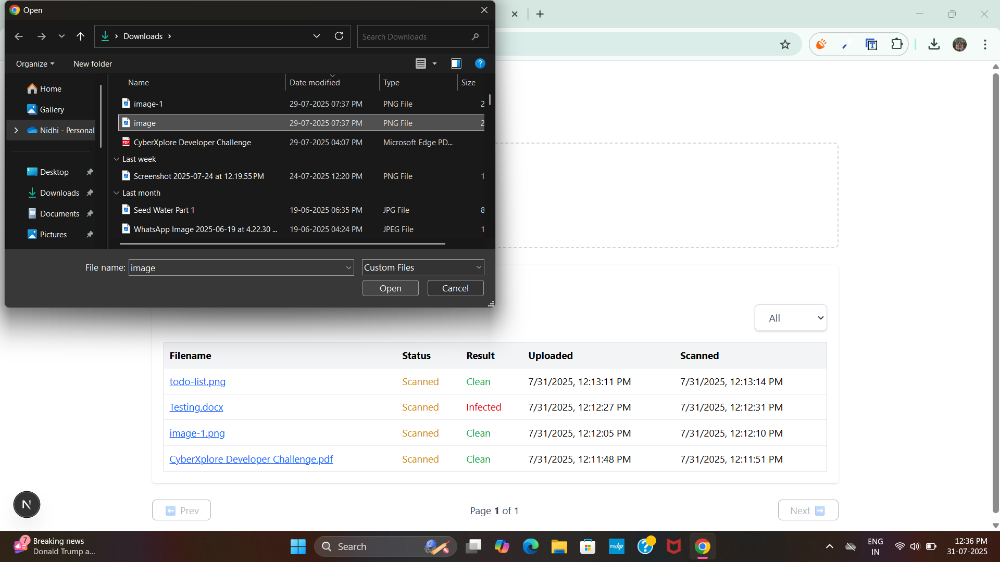
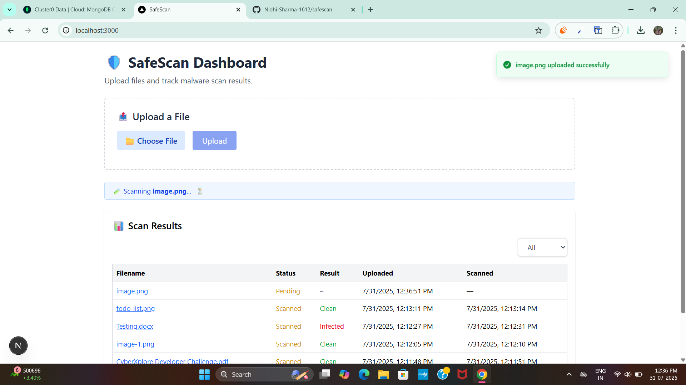
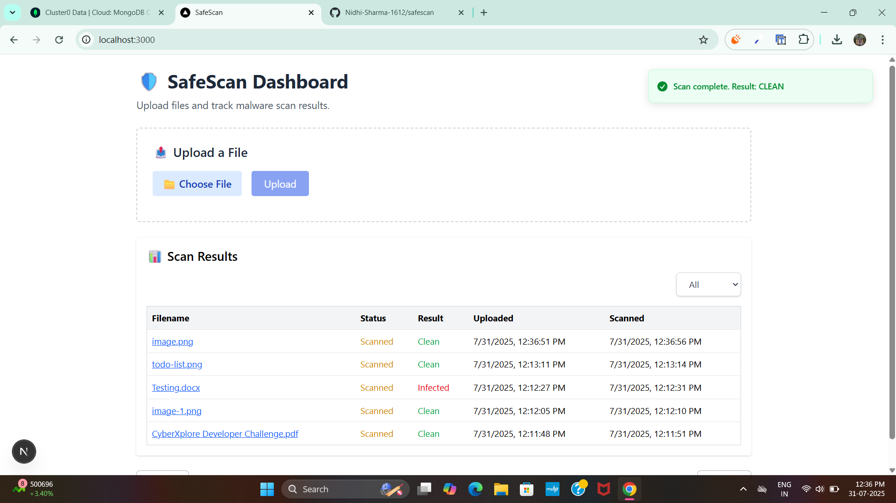
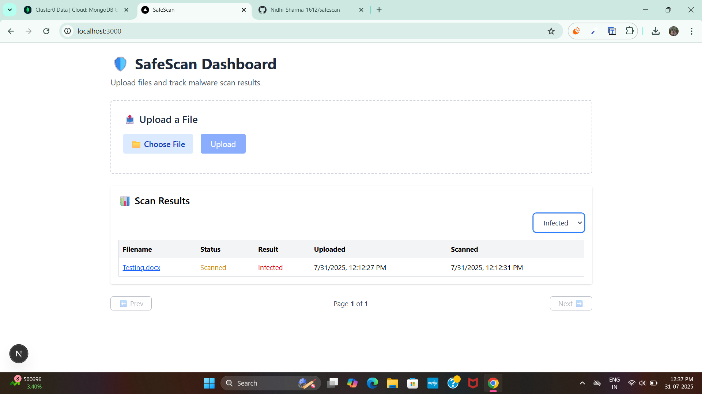

# 🛡️ SafeScan

SafeScan is a full-stack application for uploading files and scanning them for simulated malware using a background worker queue.

---

## 🔧 Getting Started

1. **Clone the repository**:

```bash
git clone https://github.com/Nidhi-Sharma-1612/safescan.git
cd safescan
```

---

## 📦 Backend Setup

1. **Install dependencies**:

```bash
cd backend
npm install
```

2. **Environment setup**:

Create a `.env` file inside `backend` with the following:

```
PORT=5000
MONGODB_URI=your_mongodb_connection_string
```

> Make sure MongoDB URI points to the correct database (e.g., `safescan`) using `?retryWrites=true&w=majority` and use `dbName` in the connection config.

3. **Start backend server**:

```bash
npm run dev
```

This will start the backend at `http://localhost:5000`.

---

## 🌐 Frontend Setup

1. **Install dependencies**:

```bash
cd frontend
npm install
```

2. **Start frontend**:

```bash
npm run dev
```

This will start the frontend at `http://localhost:3000`.

---

## 🧪 Simulated Malware Scanning

- When a file is uploaded, its metadata is stored in MongoDB.
- A job is enqueued to a custom in-memory queue.
- A worker picks jobs every second and:
  - Simulates a 2–5 second scan delay
  - Flags file as `infected` if its content contains `rm -rf`, `eval`, or `bitcoin`
  - Marks file `clean` otherwise

> The scanning worker runs via `src/workers/scanWorker.ts`.

---

## 🚀 Running Entire App Locally

In separate terminals:

```bash
cd backend && npm run dev
```

```bash
cd frontend && npm run dev
```

Open [http://localhost:3000](http://localhost:3000) to use the dashboard.

---

## 🧰 Tech Stack

- **Frontend**: Next.js, TypeScript, Tailwind CSS
- **Backend**: Node.js, Express, TypeScript
- **Queue**: In-memory job queue
- **Database**: MongoDB (Mongoose)

---

## ✅ Features Implemented

- File upload with size/type restrictions
- Local storage using `multer`
- MongoDB integration with scan metadata
- Background scanning with queue simulation
- Frontend filter & pagination
- Toast messages & responsive UI

---

## 🖼️ Project Screenshots

### Dashboard View



### File Uploading



### Scanning in Progress



### Scan Completed



### Filter by Infected


